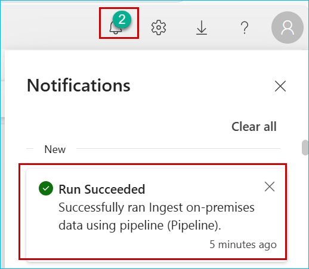

## Exercise 1: Loading Data into SQL Database

This module covers the basics of getting started with **SQL Database in Microsoft Fabric**. You will learn how to **create workspaces**, create a **SQL Database in Microsoft Fabric**, and **seed the database** with initial data that will be used in later modules. You will see how simple it is to create the databases by providing a name. And even more exciting, loading the initial data into SQL Database can be achieved without any code! This reduces maintenance effort while delighting developers!

---

### Task 1.1: Load Data from Azure SQL Database

In this task, you will use **Dataflow Gen2** to ingest data and efficiently copy it from **Azure SQL Database** to **SQL Database in Microsoft Fabric**.

#### Activity: Create a new Microsoft Fabric workspace

1. Open a new tab and paste ``app.powerbi.com`` into the browser then press **Enter**.

    ```
    app.powerbi.com
    ```

2. **Sign in** with your **Azure AD** credentials. If you are not already signed in, you will be redirected to the Microsoft Fabric login page.


> **Note:** Close any pop-up that appears on the screen.


3. From the left navigation pane, click on **Workspaces** and then the **+ New workspace** button.

   

4. In the **Name** field, enter **<inject key= "WorkspaceName" enableCopy="true"/>** and then expand **Advanced Settings**.

    > **Note:** It is very Important to use the workspace name provided above in the lab for a seamless experience.

    > **Note:** If the name is already taken, refresh the page and check again. A workspace with that name may already be created. If so, add a different suffix until the name is available.

   

5. Enable **Fabric capacity**, select the **Capacity** from the dropdown, and click **Apply** to proceed.

   

    > **Note:** Wait for the Power BI Workspace to load.

6. If you see a pop-up like the one shown below, click **Got It** to proceed.

   

#### Activity: Create a new SQL Database in Microsoft Fabric

1. Click on **+ New item** and type **SQL** in the search bar, then select **SQL Database (preview)**.

"

2. In the **Name** field, enter ```Contoso_database``` and click on the **Create** button. Database creation should take less than a minute.

```
Contoso_database
```


3. When the new database is provisioned, on the **Home page** notice that the Explorer pane is showing database objects.


4. Under **Build your database**, three useful tiles can help you get your newly created database up and running.


- **Sample data** - Lets you import sample data into your Empty database.
- **T-SQL** - Gives you a web-editor that can be used to write T-SQL to create database objects like schema, tables, views, and more. For users who are looking for code snippets to create objects, they can look for available samples in the **Templates** drop down list at the top of the menu.
- **Connection strings** - Shows the SQL Database connection string that is required when you want to connect using **SQL Server Management Studio**, the mssql extension with **Visual Studio Code**, or other external tools.


#### Activity: Use a Microsoft Fabric Pipeline to load data from the On-premises database to the SQL Database


Data Factory for Microsoft Fabric is a powerful cloud-based data integration service that allows you to create, schedule, and manage workflows for various data sources. 

1. Click on the **New data pipeline** option.


3. In the name field, enter ``Ingest data from Azure SQL DB``and click on the **Create** button.


4. From the **Home** tab of the pipeline editor, click on the **Copy data** dropdown and select **Use copy assistant** option.


5. On the **Home** pane, Search for **Azure SQL** then select the **Azure SQL database** option.


>**Note:** Note: To fill in the details for required fileds, we need to fetch the details from the SQL Database resource deployed in the Azure Portal.


6. Navigate to the [Azure Portal]('https://portal.azure.com/'), in the resource group **rg-fabcon...**, search for **sql** in the resource group window and click on the **SalesDb...** resource.


7. Copy the **Server** name.


8. Navigate back to the **Microsoft Fabric** tab on your browser.

9. On the **Connection settings** pane, in the **Server** field, paste the value you copied in step number **6**, and in the **Database** field, paste ```SalesDb```.


10.  Scroll down and select **Basic** in the **Authentication kind** dropdown. Enter ``labsqladmin`` as the **Username**, ``Smoothie@2025`` as the **Password** and click on the **Next** button.

```
    Username : labsqladmin
```

```
    Password : Smoothie@2025
 ```

11. Check **Select all** box and click on the **Next** button.


12. Click on **OneLake** and select existing **SQL Database**.


#### Activity: Validate the data transfer and ensure schema compatibility

1. Select the **Load to new table** radio button and and wait for the **column mapping** to appear.

2. Click on the **Next** button.


3. Under Options, ensure that **Start data transfer immediately** remains **enabled** (default setting).

4. Click on **Save + Run** to proceed.


5. Click on the **Ok** button in the **Pipeline run** window..


6. Click on the **Bell** icon at the top right of the screen to verify the Running status of the pipeline.



#### Activity: Verify the data transfer by querying tables in the SQL Database

1. Click on **Workspaces** and select the **<inject key= "WorkspaceName" enableCopy="true"/>** workspace.


2. Search for **database** and select the **Contoso_database**.


3. Click on **Refresh** then click on the **New Query** icon.


4. Paste the query ```SELECT * FROM inventory```, click on the **Run** icon and then check the output.


There you go! Your data has been transferred from the Azure SQL Database to the Microsoft Fabric SQL Database.

Congratulations! You have successfully created your database in a new Microsoft Fabric workspace and ingested data from **Azure SQL Database**. You are ready to move on to the next exercise: **Introduction to Copilot for SQL Database**
