## Exercise 3: Data Serving

In this exercise, you will create a **semantic model** from the data previously loaded into the **SQL Database in Microsoft Fabric**. You will then use **Copilot** to gain insights and generate a report, enhancing data-driven decision-making. It’s like having a business analyst at your beck and call, who does not take coffee breaks, fall sick and is available 24 hours!

---
>**Note:** Follow the steps provided in the task below. The Click-by-Click is available as a backup option in case of any technical issues preventing you from performing the lab in the actual environment.Before starting this exercise, open a backup Click-by-Click using the following hyperlink in a new tab, then return to the browser.
[Click-by-Click](https://regale.cloud/Microsoft/play/4470/04-data-serving#/0/0)
---


### Task 3.1: Build Reports with Power BI

1. Click on **Workspaces** and select the **<inject key= "WorkspaceName" enableCopy="true"/>** workspace.

   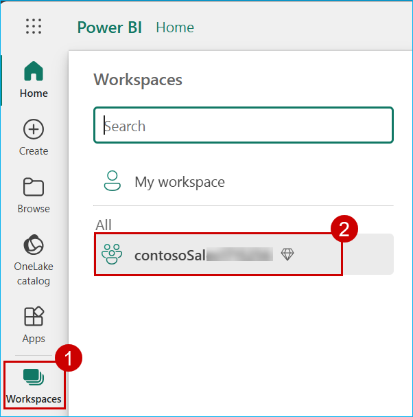

2. Click on the **Contoso_database**.

   > **Note:** Make sure that you are opening the SQL analytics endpoint.

   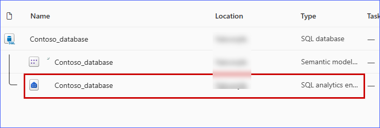

3. Click on the **Reporting** tab and select **New semantic model**.

   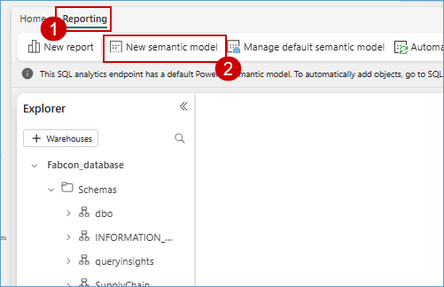

4. In the **Name** field, enter ``website_bounce_rate_model``.

    ```
    website_bounce_rate_model
    ```

5. Select workspace as **<inject key= WorkspaceName enableCopy="true"/>**.

   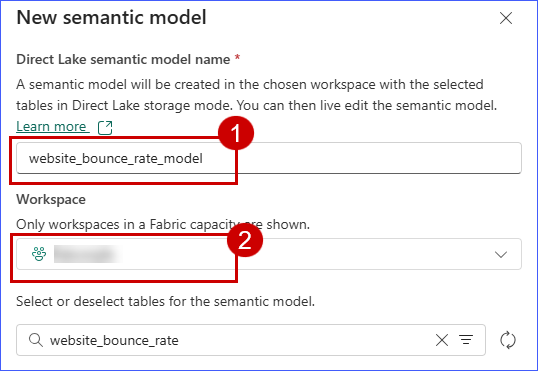

6. Search for **website_bounce_rate** and select **website_bounce_rate table**, then click on the **Confirm** button.

   ```
   website_bounce_rate
   ```

   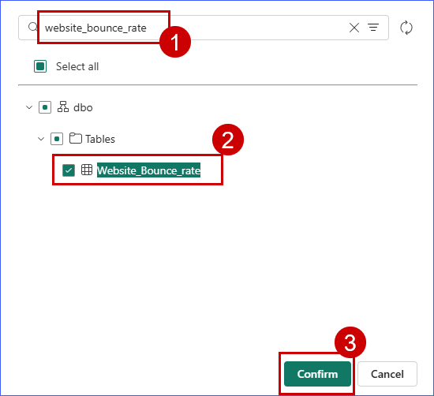

   **Note:** Wait for the semantic model creation.

#### Activity: Connect Power BI to the SQL Database in Microsoft Fabric

1. Click on the **Settings** icon and select **Power BI settings** from the **Resources and extensions** section.

   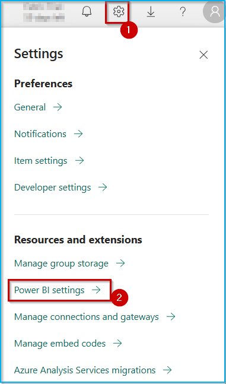

2. Select the **Semantic models** tab and select your Semantic model.

   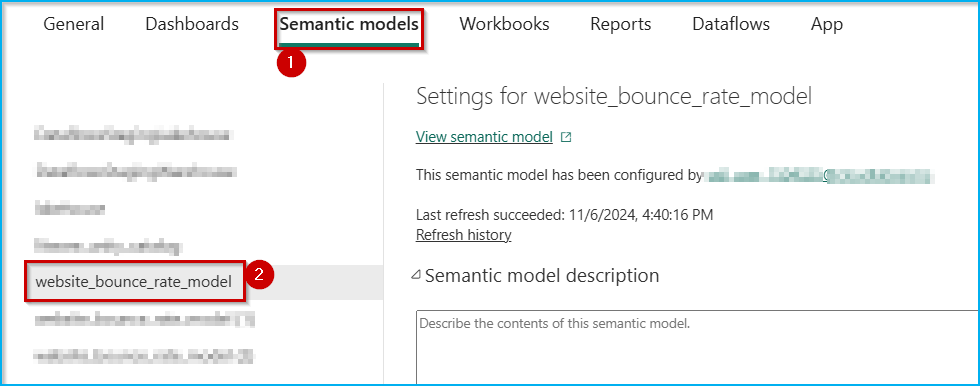

3. Scroll down to the **Q&A** section and expand it, then select the **Turn on Q&A to ask natural language questions about your data** checkbox, and click on **Apply**.

   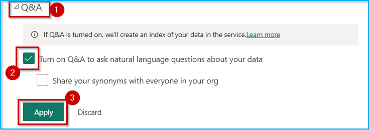


4. Click on the **<inject key= "WorkspaceName" enableCopy="false"/>** workspace from the left navigation menu.

5. Select the ellipsis (three dots) next to the website_bounce_rate semantic model.

   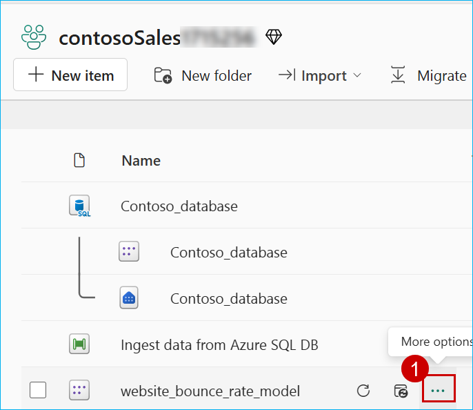

6. To create a new report using this semantic model, click on **Create report**.

   

7. Click the **Try Free**** button in the pop-up window.
8. In the confirmation dialog, click the **Got it** button to continue.

   

#### Activity: Use Copilot AI in Power BI to enhance report creation and generate insights

1. Click on the **Copilot** icon and collapse the other panes named Filters, Visualizations and Data.

   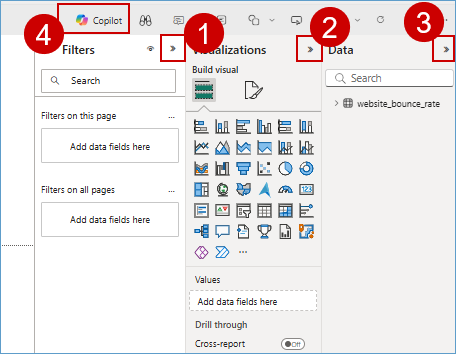

   >**Note:** Close any pop-up that appears on the screen.

   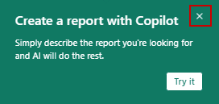

2. Toggle the **Preview** button to the right side to enable it and click on **Get started**.

   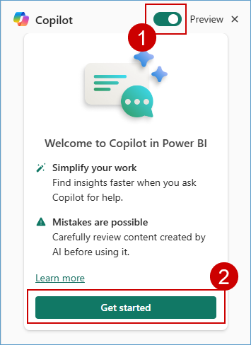

    You will now see how easy it is for a Data Analyst to create compelling Power BI reports and get deep insights with literally no hands-on coding!
	
3. Click on the **Prompt Guide** button.

    

4. Select the option **What's in my data?**

   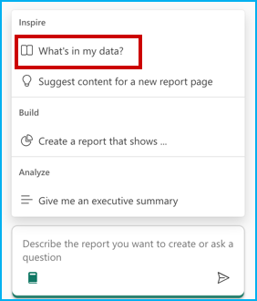

    The first option, 'What’s in my data?' provides an overview of the contents of the dataset, identifies and describes what’s in it and what the attributes are about. So, there’s no need to wait for someone to explain the dataset. This improves the efficiency and volume of report creation.

   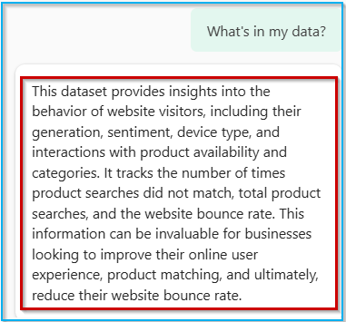

5. Click on the Copilot **chat box** field and enter the following prompt.

    ```
    Create a report Bounce Rate analysis, to show the correlation between customer sentiment, particularly among millennials and Gen Z, unsuccessful product searches across different devices, and the website's bounce rate by customer generations.
    ```

6. Click on the **Send** button and wait for the results to load. 

   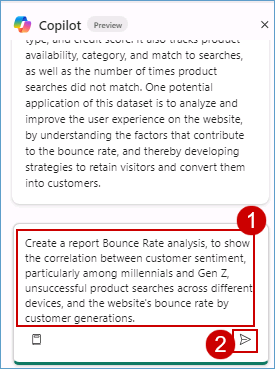
	
    >**Note:** If you see the error message saying, 'Something went wrong.', try refreshing the page and restart the task. Being in a shared environment, the service may be busy at times.
    >- If Copilot needs additional context to understand your query, consider rephrasing the prompt to include more details.
    
    >**Note:** The responses from Copilot may not match the ones in the screenshot but will provide a similar response.

   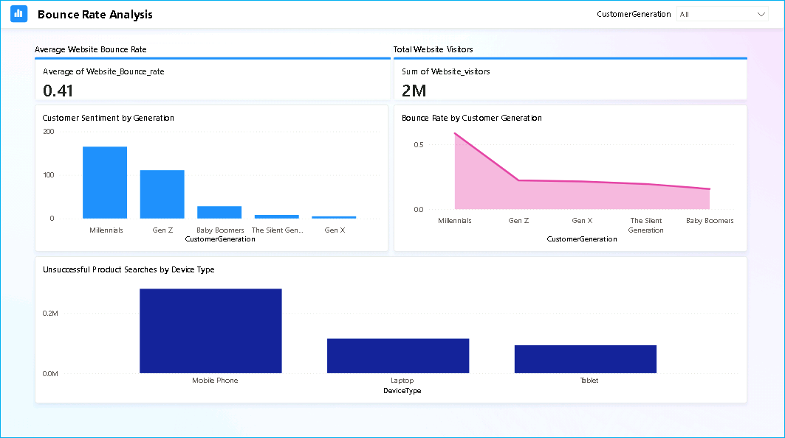

    Based on this report, we notice that the website bounce rate for Contoso is especially high amongst the Millennial customer segment. Let’s ask Copilot if it has any recommendations for improving this bounce rate based on the results and data in the report.

    We’ll ask Copilot for suggestions based on the results and data in the report. 

7. Enter the following prompt in Copilot, and press the **Send** button.

    ```
    Based on the data in the page, what can be done to improve the bounce rate of millennials?
    ```

   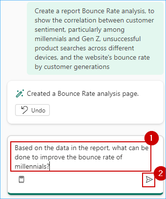
	
8. Look at the suggestions Copilot provided. Copilot creates the desired Power BI report and even goes a step further to give powerful insights. To improve the website bounce rate, Contoso needs to transform their mobile website experience for millennials. This helps them reduce their millennial related customer churn too! Now, what if Contoso’s leadership team needed a quick summary of this entire report? **Smart Narrative** to the rescue!
	
   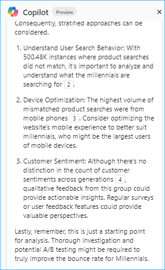
	
9. Expand the **Visualizations** pane and select the **Narratives** visual. 

   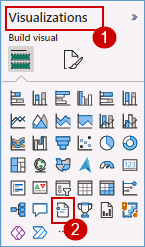

10. Click on **Copilot (preview)** within the visual.

    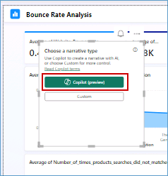
	
11. Select **Give an executive summary**. 

12. Click on **Update** and observe the generated summary. See how easy it was to get an executive summary with absolutely no IT resource dependency!
 
    >**Note:** If you don't see the 'Give an executive summary' option, click on the **Copilot narrative** chat box field, enter the prompt below, and click on **Update**:
    ``Summarize the data, provide an executive summary, indicating important takeaways.``

    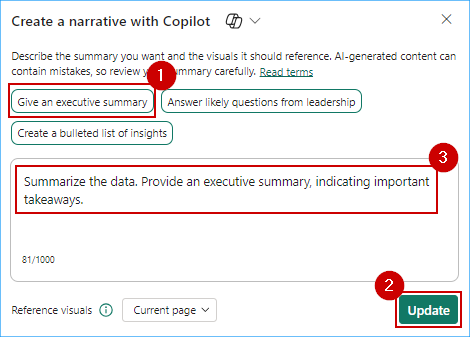

13. Expand the narrative from the corner to get a better readable view of the result.

    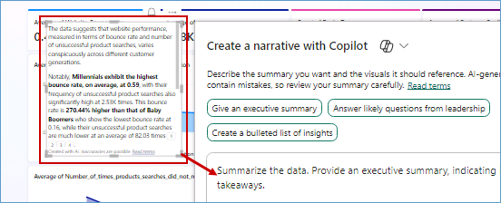

14. Click on the **Close** button in the pop-up window.

    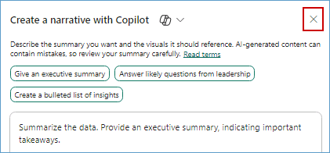
	
The summary can also be generated in another language, if specified. Additionally, the summary updates if you filter the report on any visual.

Congratulations! You have now successfully generated a report using the data that was landed earlier in the **SQL Database**. You are ready to move on to the next exercise: **Exploring GraphQL API Endpoints in Microsoft Fabric**