## Exercise 5 : Creating Mirrored Azure Cosmos DB (Optional)

Mirroring in Fabric provides an easy experience to avoid complex ETL (Extract Transform Load) and integrate your existing Azure Cosmos Database estate with the rest of your data in Microsoft Fabric.


1. Select **<inject key= "WorkspaceName" enableCopy="true"/>** workspace from the left navigation pane.

   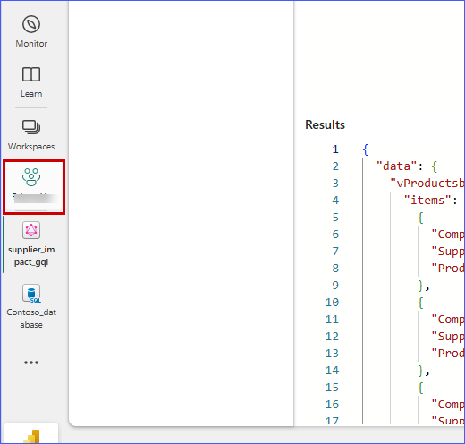

2. Click on the **New item** icon, search for **Cosmos** in the search bar then select **Mirrored Azure Cosmos DB...**.

   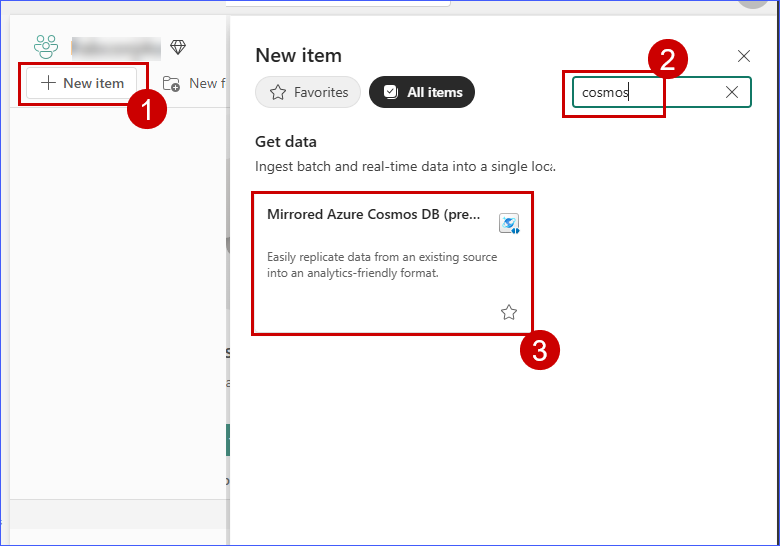

3. When prompted to **Choose a database connection to get started**, look for **New sources** and select **Azure Cosmos DB v2**.

   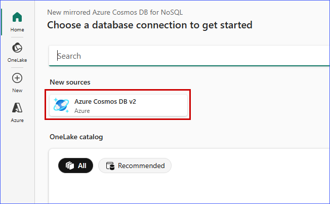

    >**Note:** To fill in the details for required fields, we need to fetch the data from the Cosmosdb resource deployed in the Azure Portal.

10. In the **Cosmos DB Endpoint** field, paste: <inject key="CosmosEndpoint" enableCopy="true"/>

11. Select **Account key** for Authentication kind, paste the following in the **Account Key** field: <inject key="CosmosEndpoint" enableCopy="true"/>  and click on the **Connect** button.

    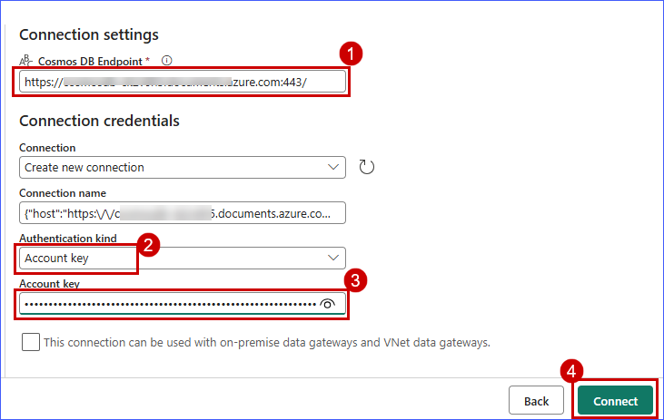

12. Click on the dropdown for Database, then select **Telemetry** and click on **Connect** button.

    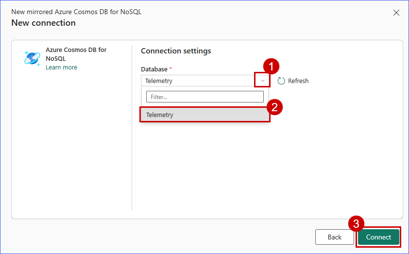

13. Click on the **Connect** button.

    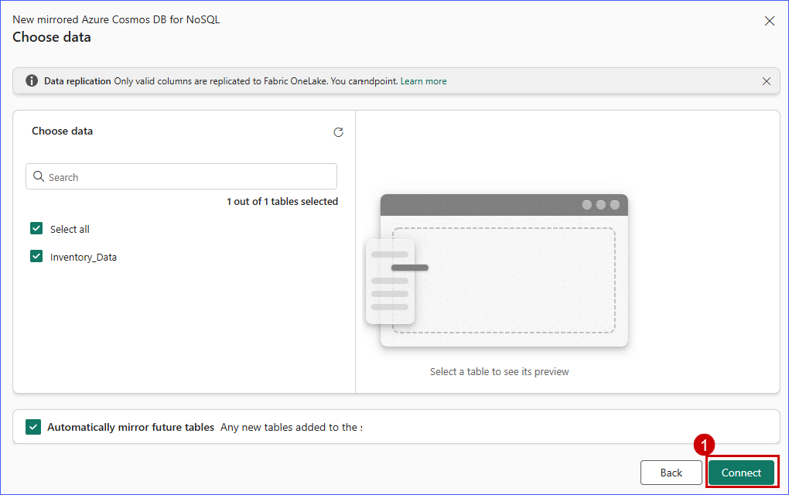

14. In the **Name** field, paste ```Telemetry```,click on the **Create mirrored database** button.

    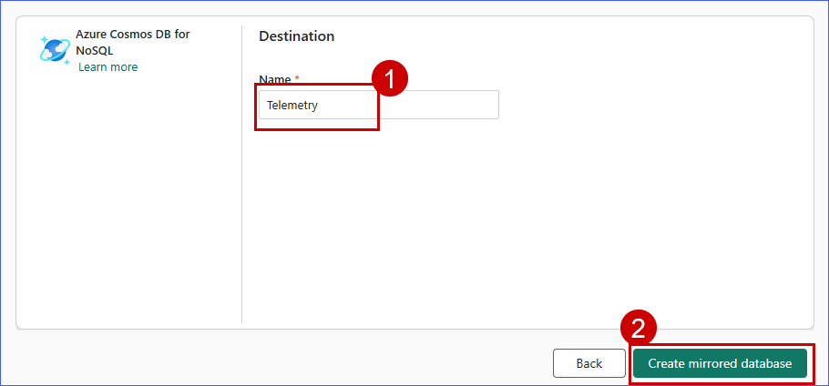

<!-- 15. Click on **Monitor replication** button to track the replication status.

 -->

15. Wait until the **Rows replicated** statistics are displayed. If not, **Refresh** the **Monitor replication** tab as shown in the following screen. Now, Azure Cosmos DB has been successfully mirrored.

    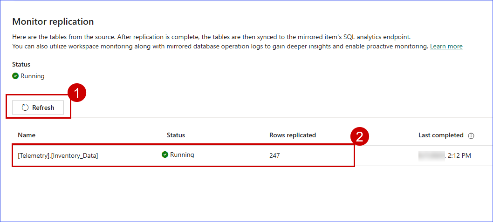

<!-- 17. Close the **Monitor replication** window. -->

<!--  -->

16. Select **SQL analytics endpoint** from top right **dropdown** box.

    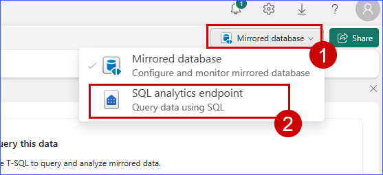

17. Click on the mirrored table **Inventory_Data** to see data preview.

    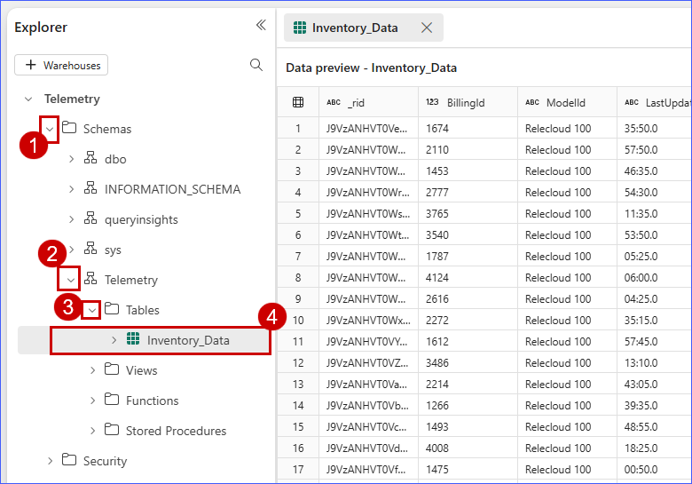

18. Click on **New SQL query** 

    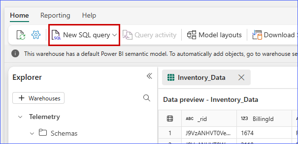

19. Copy the following **SQL query** in query editor and click on the **Run** button.

This query retrieves the average available inventory per product. Since the mirrored database resides in OneLake, we can create a semantic model that combines data from both the SQL database in Fabric and the mirrored database to enable advanced analytics.

```
    SELECT ProductId, AVG(AvailableInventory) AS AvgInventory
    FROM [Telemetry].[Telemetry].[Inventory_Data]
    GROUP BY ProductId;

```
  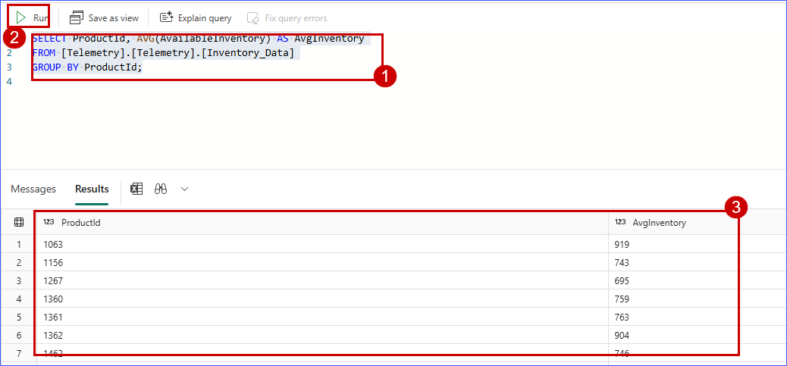
